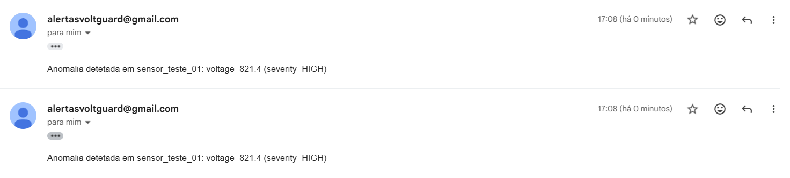
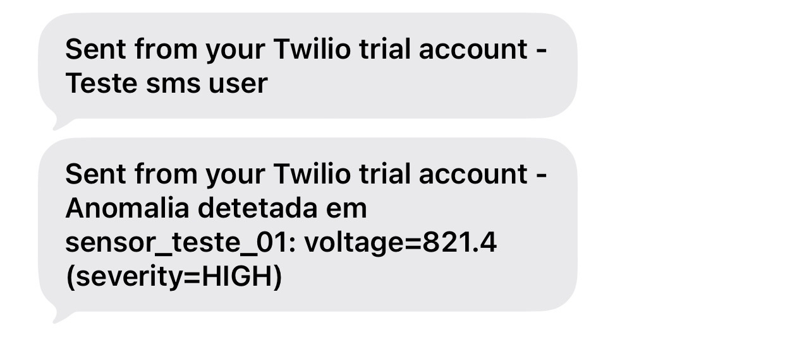
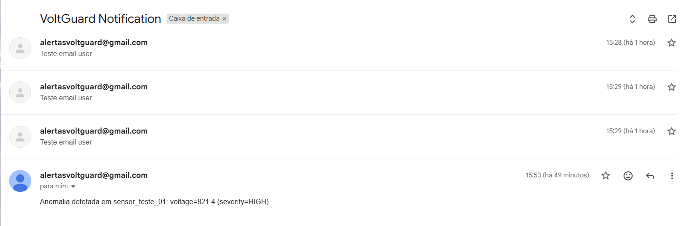

# API de Notificações VoltGuard

## Enquadramento
A API de Notificações do VoltGuard funciona como gateway multicanal para envio de comunicações operacionais e alertas. O serviço centraliza validação, roteamento por canal e aplicação de preferências de utilizador, garantindo consistência entre backend, frontend e integrações de plataforma.

## Objetivos
- Centralizar o envio de notificações para canais heterogéneos.
- Aplicar preferências por utilizador antes da tentativa de entrega.
- Suportar estratégias de entrega imediata e diferida (digest).
- Expor endpoints públicos de preferências com segurança por segredo dedicado.

## Arquitetura funcional

### Fluxo principal
1. Um cliente envia um pedido para POST /v1/notifications.
2. O pedido é validado e persistido.
3. O serviço avalia preferências do utilizador associado ao target.
4. O motor de entrega decide entre:
   - entrega imediata,
   - enfileiramento para digest,
   - bloqueio por preferência.

### Gestão de preferências
- GET /v1/preferences?secret=...: consulta do estado atual.
- PATCH /v1/preferences?secret=...: atualização de canais e política de alertas.

### Canais suportados
- Email via SMTP nativo (smtplib), incluindo Gmail com App Password.
- SMS e WhatsApp via Twilio.

### Persistência
- notifications: histórico, payload e estado de entrega.
- user_preferences: targets, canais ativos e política de alert_type.
- digest_queue: notificações com envio diferido.
- notification_audit: trilho de auditoria estruturado por evento de ciclo de vida.
- channels: configuração dinâmica opcional por canal.

### Dados iniciais
O serviço suporta seed de user_preferences para ambientes de desenvolvimento/teste, incluindo secret, user_id, targets e regras de entrega.

## Contrato da API

### Segurança
- Segurança global por auth_token na query string.
- Endpoints públicos de preferências sem auth_token global (security: []).

### Idempotência no envio
- `POST /v1/notifications` aceita header `Idempotency-Key` (ou `X-Idempotency-Key`).
- Se a mesma chave for reenviada com o mesmo payload, devolve resposta idempotente (sem duplicar notificação).
- Se a mesma chave for reenviada com payload diferente, devolve `409 conflict`.

### Endpoints principais
- POST /v1/notifications
- GET /v1/notifications
- GET /v1/notifications/{id}
- POST /v1/digest/process
- POST /v1/channels
- GET /v1/preferences
- PATCH /v1/preferences
- GET /health

### Campos obrigatórios em POST /v1/notifications
- client_id
- target
- channel
- alert_type (critical ou warnings)
- message_template

## Estados de processamento
- PENDING: notificação criada e ainda não entregue.
- DELIVERED: entrega concluída com sucesso.
- FAILED: falha no provider.
- ABORTED_BY_PREFERENCE: canal desativado para o utilizador.
- QUEUED_FOR_DIGEST: entrega adiada para processamento de digest.

Nota: o contrato normaliza estados em uppercase para consistência entre backend/frontend.

## Auditoria estruturada
Cada notificação gera eventos na coleção `notification_audit`, incluindo:
- CREATED
- IDEMPOTENCY_REPLAY
- ENQUEUED_FOR_DIGEST
- DELIVERY_ATTEMPT
- DIGEST_DELIVERED
- DIGEST_FAILED

## Configuração e segredos

### Variáveis sensíveis principais
- NOTIFICATIONS_AUTH_TOKEN
- SMTP_HOST
- SMTP_PORT
- SMTP_USERNAME
- SMTP_PASSWORD
- SMTP_FROM_EMAIL
- SMTP_USE_TLS
- TWILIO_ACCOUNT_SID
- TWILIO_AUTH_TOKEN
- TWILIO_FROM_PHONE
- TWILIO_FROM_WHATSAPP

## Integrações

### Compositor Backend
- Proxy para endpoints de notificações e preferências.
- Endpoint de simulação manual do fluxo de anomalia para notificação.
- Suporte de identificação por user_id (com fallback opcional por secret).

### Compositor Frontend
- Página pública de preferências via link com secret.
- Leitura inicial por GET /v1/preferences.
- Atualização por PATCH /v1/preferences.

## Procedimentos de teste

### Nota de contexto (ambiente académico)
Durante a fase de desenvolvimento académico, os testes de entrega podem utilizar números de telemóvel e endereços de email pessoais da equipa. Esta prática é estritamente temporária e deve ser substituída por contactos de teste dedicados antes de qualquer utilização em ambiente de pré-produção ou produção.

### 1) Arranque de serviços
```bash
docker compose up -d --build notifications-db notifications-service compositor-backend compositor-frontend
```

### 2) Health check
PowerShell:
```powershell
Invoke-RestMethod -Method Get -Uri "http://localhost:8083/health"
```

Linux/macOS:
```bash
curl -s "http://localhost:8083/health"
```

### 3) Validação de preferências públicas
```bash
curl -s "http://localhost:8083/v1/preferences?secret=pref_secret_joao_silva"
```

```bash
curl -s -X PATCH "http://localhost:8083/v1/preferences?secret=pref_secret_joao_silva" \
  -H "Content-Type: application/json" \
  -d '{"channels":{"email":true,"sms":true},"alert_type":{"critical":"immediate","warnings":"digest"}}'
```

### 4) Envio direto na API de notificações
```bash
curl -s -X POST "http://localhost:8083/v1/notifications?auth_token=your_secure_auth_token" \
  -H "Content-Type: application/json" \
  -d '{"client_id":"energy_composer","target":"franciscomurcela0@gmail.com","channel":"email","alert_type":"critical","message_template":"Teste API Notifications"}'
```

### 4.1) Envio idempotente (sem duplicação em retry)
```bash
curl -s -X POST "http://localhost:8083/v1/notifications?auth_token=your_secure_auth_token" \
  -H "Content-Type: application/json" \
  -H "Idempotency-Key: notif-2026-04-15-001" \
  -d '{"client_id":"energy_composer","target":"franciscomurcela0@gmail.com","channel":"email","alert_type":"critical","message_template":"Teste idempotente"}'
```

Repetir o mesmo pedido com a mesma chave e mesmo payload devolve replay idempotente (sem criar novo registo).

### 5) Simulação manual com comando HTTP
PowerShell:
```powershell
Invoke-RestMethod -Method Post -Uri "http://localhost:8080/api/anomalies/simulate-notification" -ContentType "application/json" -Body '{"user_id":"op_joao_silva","source_id":"sensor_teste_01","metric_name":"voltage","value":821.4,"severity":"HIGH","alert_type":"critical"}'
```

Linux/macOS:
```bash
curl -s -X POST "http://localhost:8080/api/anomalies/simulate-notification" \
  -H "Content-Type: application/json" \
  -d '{"user_id":"op_joao_silva","source_id":"sensor_teste_01","metric_name":"voltage","value":821.4,"severity":"HIGH","alert_type":"critical"}'
```

### 6) Simulação manual com scripts utilitários
Scripts disponíveis na raiz do repositório:
- scripts/simulate-notification.ps1
- scripts/simulate-notification.sh

PowerShell (Windows):
```powershell
.\scripts\simulate-notification.ps1 -UserId op_joao_silva
```

Utilizadores seeded válidos para testes rápidos:
- `op_joao_silva`
- `op_maria_costa`

PowerShell com parâmetros opcionais:
```powershell
.\scripts\simulate-notification.ps1 -UserId op_joao_silva -Severity CRITICAL -AlertType warnings -MetricName current -Value 912.6
```

Linux/macOS:
```bash
bash ./scripts/simulate-notification.sh op_joao_silva
```

Linux/macOS com parâmetros opcionais:
```bash
SEVERITY=CRITICAL ALERT_TYPE=warnings METRIC_NAME=current VALUE=912.6 bash ./scripts/simulate-notification.sh op_joao_silva
```

### 7) Trigger manual de digest (ambiente local)
Pré-condições para funcionamento:
- A preferência do utilizador para o tipo de alerta em causa deve estar em `digest`.
- Têm de existir mensagens na `digest_queue` com estado `QUEUED_FOR_DIGEST`.

Pré-visualização sem envio (`dry_run`):
```bash
curl -s -X POST "http://localhost:8083/v1/digest/process?auth_token=your_secure_auth_token" \
  -H "Content-Type: application/json" \
  -d '{"batch_size":50,"dry_run":true}'
```

Execução real de um lote:
```bash
curl -s -X POST "http://localhost:8083/v1/digest/process?auth_token=your_secure_auth_token" \
  -H "Content-Type: application/json" \
  -d '{"batch_size":50,"dry_run":false}'
```

Notas:
- O trigger processa apenas registos com estado `QUEUED_FOR_DIGEST`.
- `batch_size` aceite: 1 a 500.
- O endpoint foi desenhado para uso manual em desenvolvimento e para futura integração com scheduler em produção.

### 8) Trigger de digest com scripts utilitários
Scripts disponíveis na raiz do repositório:
- scripts/process-digest.ps1
- scripts/process-digest.sh

Nota: estes scripts só enviam notificações se as pré-condições acima forem cumpridas.

PowerShell (Windows) — pré-visualização sem envio:
```powershell
.\scripts\process-digest.ps1
```

PowerShell (Windows) — execução real:
```powershell
.\scripts\process-digest.ps1 -DryRun:$false -BatchSize 100 -AuthToken "your_secure_auth_token"
```

Linux/macOS — pré-visualização sem envio:
```bash
bash ./scripts/process-digest.sh
```

Linux/macOS — execução real:
```bash
DRY_RUN=false BATCH_SIZE=100 AUTH_TOKEN=your_secure_auth_token bash ./scripts/process-digest.sh
```

## Diagnóstico rápido

### 401 Unauthorized
- Confirmar auth_token no pedido.
- Confirmar valor efetivo de NOTIFICATIONS_AUTH_TOKEN no runtime.

### 400 validation_error
- Confirmar presença dos campos obrigatórios.
- Confirmar valores válidos para alert_type.

### 409 conflict
- Confirmar se o `Idempotency-Key` foi reutilizado com payload diferente.

### ABORTED_BY_PREFERENCE
- Verificar se o canal está ativo nas preferências do utilizador.

### QUEUED_FOR_DIGEST
- Verificar política de alert_type configurada como digest.

### Falhas de email (SMTP)
- Validar host, porta, TLS, remetente e credenciais.
- Confirmar App Password válido quando usar Gmail.

## Evidências de entrega

### Processamento de digest


### Notificação no telemóvel (SMS)


### Notificação por email
